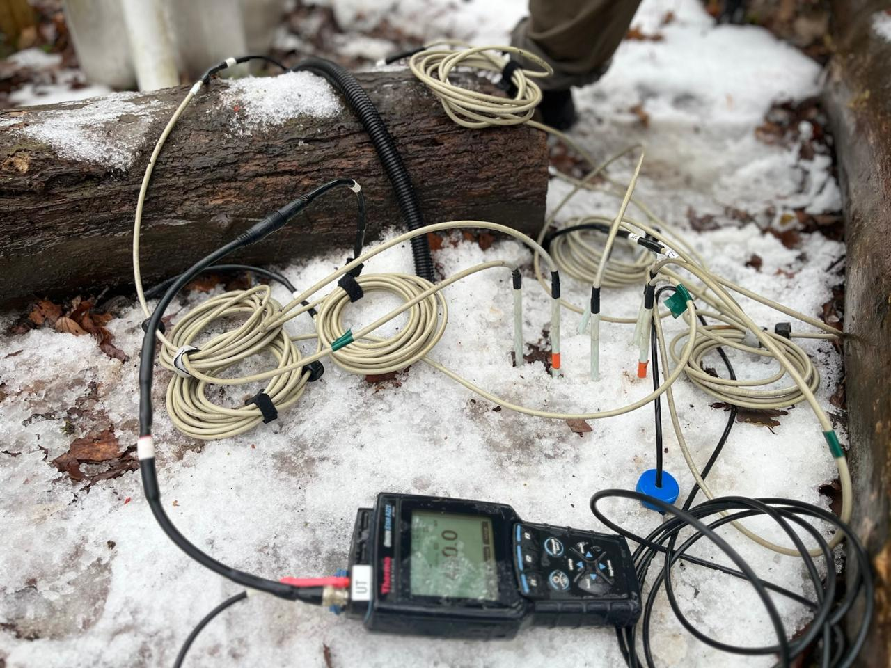
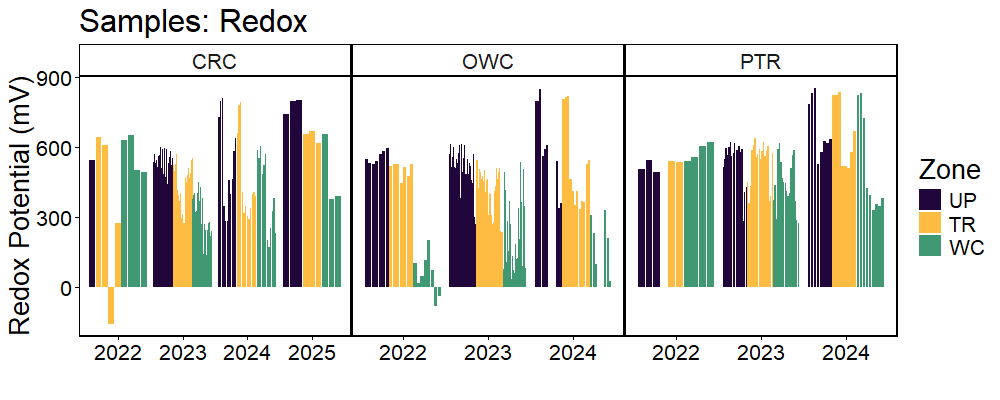
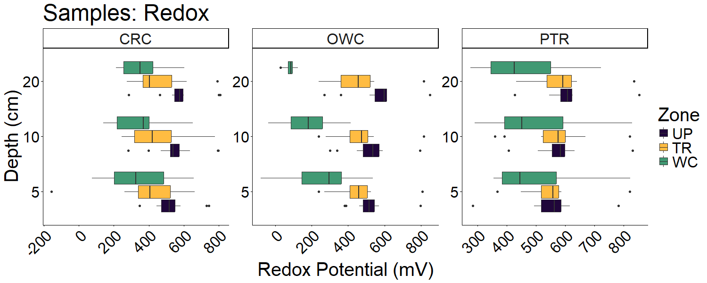

**Project: COMPASS - Synoptic Lake Erie Soil Redox Profiles** 

Data Type: Manual Redox Probe Measurements (REDOX)

Sampling Type: Soil Redox Profiles

Sampling Locations: COMPASS Synoptic Sites: CRC, OWC, PTR

 

Roberta B Peixoto; Fausto Machado-Silva; Evangelos Grammenidis; Bailey V; Michael N Weintraub (20XX): COMPASS-FME Synoptic Site Soil Redox Profiles (Manual Redox Probe). COMPASS-FME, ESS-DIVE repository. Dataset. doi:TBD accessed via Link TBD.

 

**Data Files Available:** 

"COMPASS_SynopticLE_Redox_AllData.csv" = All data from all years. QAQC'd and collated.

"COMPASS_SynopticLE_Redox_DataDictionary.csv" = Metadata / Data dictionary for AllData file that defines each column header, units, and instrumentation.

 

**Data Description:** 
 These data are measurements of soil reduction-oxidation potential (REDOX) profiles collected using REDOX probes at the COMPASS 'synoptic' sites in the Lake Erie region:  Crane Creek (CRC), Portage (PTR), and Old Woman Creek (OWC), see site descriptions below. These sites have space for time transects spanning coastal upland forest (UP), coastal upland forest transitioning to wetland (TR), and wetland (WC) plots.Soil REDOX profiles were measured at 5, 10, and 20cm depths monthly from 2022-2024 then quarterly from 2024-2025 across the plots. To make measurements, one Ag/AgCl saturated KCl reference electrode was pushed into the soil a few centimeters and six replicate soil REDOX probes were pushed into the soil to the depth of measurement and allowed to equilibrate for five minutes before recording the probe reading with a Thermo Scientific Orion pH/ORP handheld meter. After the reading, probes were pushed to the next depth of interest. Raw measurements were recorded then adjusted to account for the Ag/AgCl saturated KCl reference electrode used.

 

REDOX profiles were collected roughly from May to November at each site during 2022 and 2025. Sampling these was discontinued in 2025 due to the installation of continuous logging REDOX probes, which are included in the COMPASS Synoptic Sensor Data Releases. 

For questions about these data: contact Roberta B Peixoto (roberta.bittencourtpeixoto@utoledo.edu), Fausto Machado-Silva (fausto.silva@utoledo.edu), or Michael N Weintraub (Michael.Weintraub@utoledo.edu). 

 
 

 

**Overview Summary of Data**

 
 

 

**Site Location Descriptions**

Crane Creek (CRC) one of the COMPASS_FME synoptic sites located in the Ottawa National Wildlife Refuge, approximately 2.9 miles west of the Ottawa National Wildlife Refuge Visitor Center, Ohio at the margin of the Crane Creek river. This synoptic site consists of three plots: upland ('UP'; located at 41.61524N, 83.22889W), transition ('TR'; 41.62192N, 83.23815W), and wetland ('WC'; 41.62185N, 83.2389W). The site was established in June 2022. 

Old Woman Creek (OWC) site is located at Old Woman Creek National Estuarine Research Reserve. This synoptic site consists of three plots: upland ('UP'; located at 41.37618N, 82.50685W), transition ('TR'; 41.376017N, 82.507507W), and wetland ('WC'; 41.376445N, 82.509024W). The site was established in June 2022.

Portage Rover (PTR), one of the COMPASS_FME synoptic sites located in the Ottawa National Wildlife Refuge’s Two Rivers unit, approximately 5.5 miles west of Port Clinton, Ohio at the confluence of the Portage and Little Portage rivers. This synoptic site consists of three plots: upland ('UP'; located at 41.50148N, 83.04611W), transition ('TR'; 41.502723N, 83.045662W), and wetland ('WC'; 41.50174N, 83.04372W). The site was established in June 2022.
  

